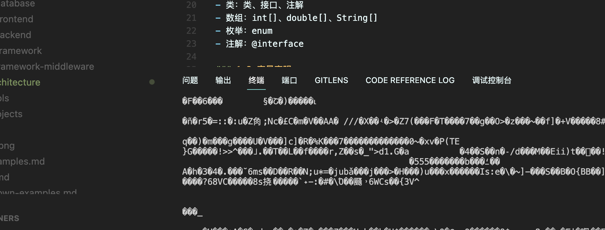

# 01_Java-Basic

## 1. 变量



### 1.1 基本类型

Java语言支持以下基本类型1111111111111：

- 整数类型：byte、short、int、long
- 浮点类型：float、double   
- 字符类型：char
- 布尔类型：boolean

### 1.2 引用类型

Java语言支持以下引用类型：

- 类：类、接口、注解
- 数组：int[]、double[]、String[]
- 枚举：enum
- 注解：@interface

### 1.3 变量声明

变量声明语法：

```java
数据类型 变量名 = 初始值;
```

例如：

```java
int age = 25;
double salary = 5000.0;
char grade = 'A';
boolean isMarried = true;
```

### 1.4 变量作用域

Java语言中，变量的作用域分为以下几种：

- 局部变量：在方法、构造方法、代码块中声明的变量，只在当前作用域内有效。